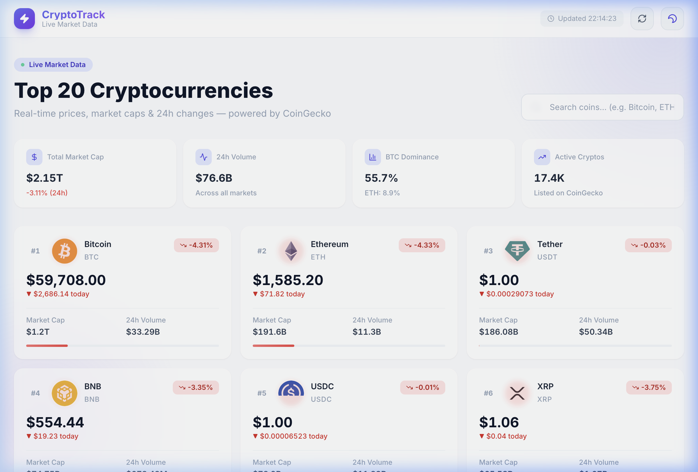
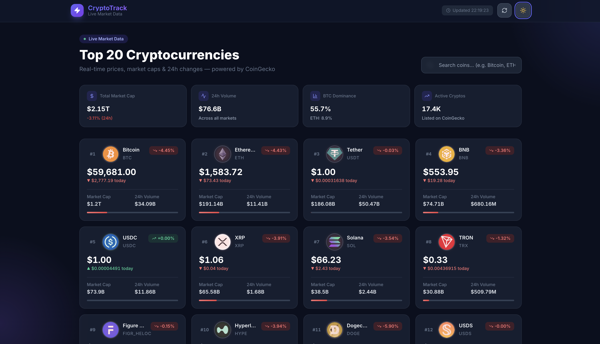

# CryptoTrack ⚡ — Live Crypto Price Dashboard

<div align="center">


[](https://react.dev/)
[](https://vitejs.dev/)
[](https://tailwindcss.com/)
[](https://axios-http.com/)
[](https://www.coingecko.com/en/api)
[](LICENSE)

**A professional, real-time cryptocurrency price tracker with a stunning glassmorphism UI.**  
Track the top 20 cryptocurrencies with live prices, market caps, and 24-hour changes.

[Live Demo](#) · [Report Bug](https://github.com/MuhammadAhmadRao/crypto-dashboard/issues) · [Request Feature](https://github.com/MuhammadAhmadRao/crypto-dashboard/issues)

</div>

---

## ✨ Features

| Feature | Description |
|---|---|
| 📊 **Live Market Data** | Fetches top 20 coins from CoinGecko API in real-time |
| 🔄 **Auto-Refresh** | Market data refreshes automatically every 60 seconds |
| 🔍 **Instant Search** | Filter coins by name or symbol with live results |
| 🌙 **Dark / Light Mode** | Theme toggle with system preference detection & persistence |
| 💀 **Skeleton Loaders** | Content-aware skeleton cards match the real layout exactly |
| ⚠️ **Error Handling** | Graceful error states with retry functionality |
| 📈 **Global Stats** | Total market cap, 24h volume, BTC/ETH dominance displayed |
| 📱 **Responsive Design** | Fluid grid from 1 column (mobile) to 4 columns (desktop) |
| ♿ **Accessibility** | ARIA labels, semantic HTML, keyboard navigable |
| 🎨 **Glassmorphism UI** | Frosted glass cards with micro-animations and hover effects |

---

## 📸 Screenshots

| Light Mode | Dark Mode |
|---|---|
|  |  |

| Mobile View | Error State |
|---|---|
|  |  |

---

## 🛠️ Technologies Used

### Core
- **[React 18](https://react.dev/)** — UI library with hooks for state & lifecycle management
- **[Vite 5](https://vitejs.dev/)** — Lightning-fast build tool and dev server
- **[Tailwind CSS 3](https://tailwindcss.com/)** — Utility-first CSS with JIT compilation

### Data & Networking
- **[Axios 1.7](https://axios-http.com/)** — HTTP client with interceptors and request/response transformation
- **[CoinGecko API v3](https://www.coingecko.com/en/api)** — Free, reliable cryptocurrency market data

### Icons & Fonts
- **[Lucide React](https://lucide.dev/)** — Beautiful, consistent icon library
- **[Inter](https://fonts.google.com/specimen/Inter)** — Modern, highly legible typeface (Google Fonts)

### Dev Tools
- **ESLint** — Code linting with React-specific rules
- **PostCSS + Autoprefixer** — CSS processing and vendor prefixes

---

## 📁 Project Structure

```
crypto-dashboard/
├── public/
│   └── favicon.svg           # SVG favicon
├── src/
│   ├── components/
│   │   ├── CryptoCard.jsx    # Individual coin card with all data
│   │   ├── EmptyState.jsx    # No search results UI
│   │   ├── ErrorState.jsx    # API error with retry button
│   │   ├── Footer.jsx        # Page footer with attribution
│   │   ├── Header.jsx        # Sticky nav with controls
│   │   ├── MarketStats.jsx   # Global market stats panel
│   │   ├── SearchBar.jsx     # Search input with clear button
│   │   ├── SkeletonCard.jsx  # Animated loading placeholder
│   │   └── ThemeToggle.jsx   # Dark/light mode button
│   ├── hooks/
│   │   ├── useCryptoData.js  # Data fetching & auto-refresh logic
│   │   └── useTheme.js       # Theme state with localStorage
│   ├── utils/
│   │   ├── api.js            # Axios client + CoinGecko endpoints
│   │   └── formatters.js     # Currency, percent & number formatters
│   ├── App.jsx               # Root component & layout orchestration
│   ├── index.css             # Global styles, Tailwind directives
│   └── main.jsx              # React entry point
├── index.html                # HTML shell with meta tags
├── vite.config.js            # Vite configuration
├── tailwind.config.js        # Tailwind theme & plugin config
├── postcss.config.js         # PostCSS pipeline
├── eslint.config.js          # ESLint flat config
└── package.json              # Dependencies & scripts
```

---

## 🚀 Installation & Setup

### Prerequisites

- **Node.js** ≥ 18.0.0 — [Download](https://nodejs.org/)
- **npm** ≥ 9.0.0 (comes with Node.js)

### 1. Clone the repository

```bash
git clone https://github.com/MuhammadAhmadRao/crypto-dashboard.git
cd crypto-dashboard
```

### 2. Install dependencies

```bash
npm install
```

### 3. Start development server

```bash
npm run dev
```

Open [http://localhost:3000](http://localhost:3000) in your browser. The app will hot-reload on file changes.

### 4. Build for production

```bash
npm run build
```

The production bundle is output to `dist/`. Preview it locally:

```bash
npm run preview
```

---

## 🔧 Configuration

The app works out-of-the-box with CoinGecko's **free public API** (no API key needed).

> **Note:** The free tier has a rate limit of ~10–30 requests/minute. The app auto-refreshes every 60 seconds to stay well within limits. If you hit rate limits, wait a moment and click the **Refresh** button.

### Optional: CoinGecko Pro API

If you have a Pro API key, create a `.env` file:

```env
VITE_COINGECKO_API_KEY=your_api_key_here
```

Then update `src/utils/api.js` to include the `x-cg-pro-api-key` header.

---

## 🌐 Deployment

### Vercel (Recommended)

```bash
npm install -g vercel
vercel --prod
```

Or connect your GitHub repository at [vercel.com](https://vercel.com) for automatic deployments on every push.

### Netlify

```bash
npm run build
# Drag and drop the 'dist/' folder to netlify.com/drop
```

Or use the Netlify CLI:

```bash
npm install -g netlify-cli
netlify deploy --prod --dir=dist
```

### GitHub Pages

```bash
# 1. Add homepage to package.json
#    "homepage": "https://MuhammadAhmadRao.github.io/crypto-dashboard"

# 2. Install gh-pages
npm install --save-dev gh-pages

# 3. Add deploy scripts to package.json
#    "predeploy": "npm run build",
#    "deploy": "gh-pages -d dist"

# 4. Deploy
npm run deploy
```

### Docker

```dockerfile
FROM node:20-alpine AS builder
WORKDIR /app
COPY package*.json ./
RUN npm ci
COPY . .
RUN npm run build

FROM nginx:alpine
COPY --from=builder /app/dist /usr/share/nginx/html
EXPOSE 80
CMD ["nginx", "-g", "daemon off;"]
```

```bash
docker build -t crypto-dashboard .
docker run -p 8080:80 crypto-dashboard
```

---

## 📡 API Reference

This app uses the **CoinGecko API v3** (free, no key required).

| Endpoint | Used For |
|---|---|
| `GET /coins/markets` | Top 20 coins with price, market cap, volume, 24h change |
| `GET /global` | Total market cap, volume, BTC/ETH dominance, active coins |
| `GET /ping` | API health check |

**Base URL:** `https://api.coingecko.com/api/v3`

---

## 🧪 Available Scripts

| Command | Description |
|---|---|
| `npm run dev` | Start Vite dev server on port 3000 |
| `npm run build` | Build optimized production bundle |
| `npm run preview` | Preview the production build locally |
| `npm run lint` | Run ESLint across all JS/JSX files |

---

## 🤝 Contributing

Contributions are welcome! Please follow these steps:

1. Fork the repository
2. Create a feature branch: `git checkout -b feature/amazing-feature`
3. Commit your changes: `git commit -m 'feat: add amazing feature'`
4. Push to the branch: `git push origin feature/amazing-feature`
5. Open a Pull Request

Please ensure your code passes `npm run lint` before submitting.

---

## 📝 License

Distributed under the **MIT License**. See [`LICENSE`](LICENSE) for details.

---

## 🙏 Acknowledgements

- [CoinGecko](https://www.coingecko.com) for the free and comprehensive crypto API
- [Lucide](https://lucide.dev) for the beautiful icon set
- [Tailwind CSS](https://tailwindcss.com) for the incredible utility-first CSS framework
- [Vite](https://vitejs.dev) for the blazing-fast dev experience

---

<div align="center">

**Made with ❤️ — Star ⭐ this repo if you found it helpful!**

[](https://github.com/MuhammadAhmadRao/crypto-dashboard)

</div>
